# QuickPick

QuickPick is an iOS application designed for creating and managing live polls. It includes user authentication, poll creation, voting, and real-time chart visualization of poll results. The application is built with SwiftUI.

---

## Features

- **User Authentication**: Login and signup functionality for secure access.
- **Poll Creation**: Create custom polls with multiple options.
- **Vote Participation**: Join and vote in live polls.
- **Poll Analytics**: View poll results in an intuitive chart.
- **Customizable UI**: Options for customizing the app's appearance.
- **Live Updates**: Real-time display of ongoing polls.

---

# Screenshots and Overview:

## Sign-Up Screen
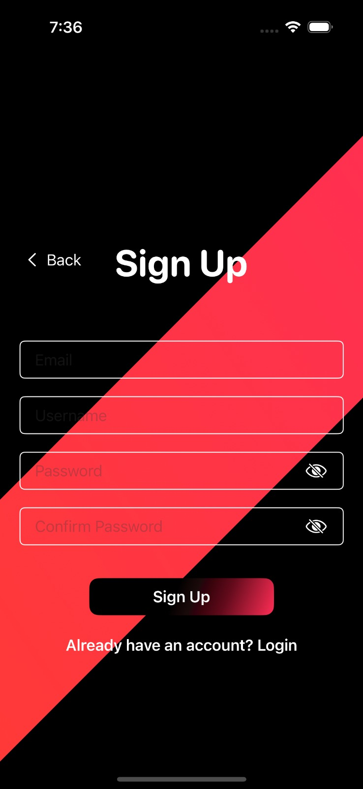
Allows new users to create an account by entering their email, username, password, and confirming their password. Features a sleek UI with a gradient design and secure password visibility toggles.

## Log-In Screen
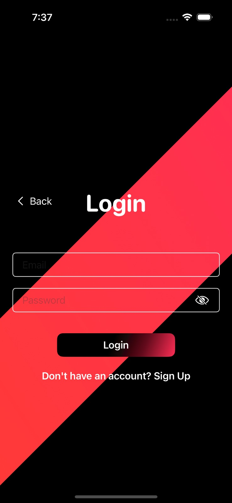
Users can log in with their credentials:

## Home Screen Screen
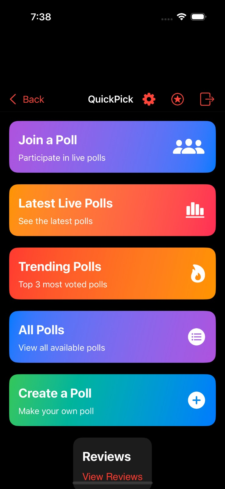
The central hub displaying options to join polls, view the latest polls, check trending polls, explore all polls, or create a new poll. Each section has colorful, visually distinct cards for easy navigation.

## Latest Polls Screen
 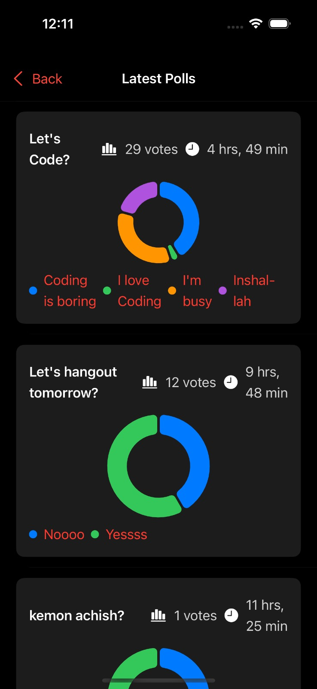
Displays the most recent polls, including details like the total number of votes, time left for the poll to end, and visually appealing donut charts for results.

## Trending Polls Screen
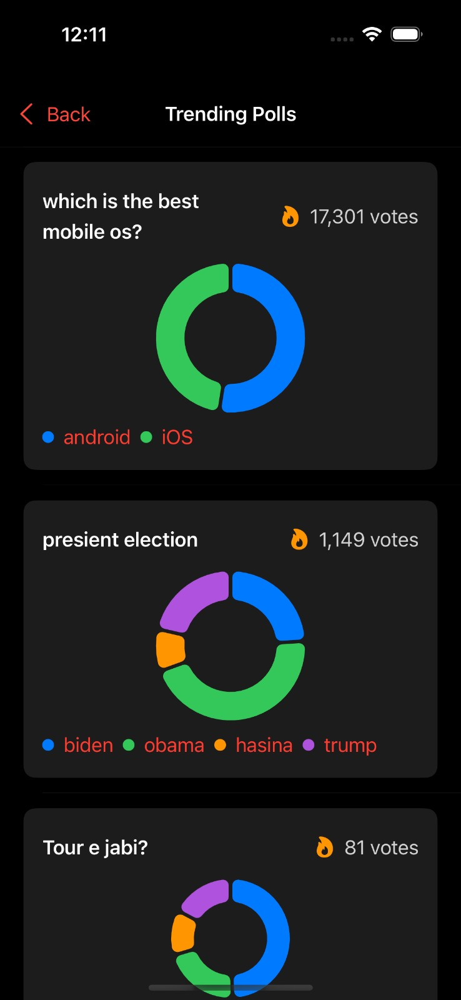
Highlights the top polls based on popularity and vote count. Each poll features a title, vote breakdown, and a chart for data visualization.

## All Polls Screen
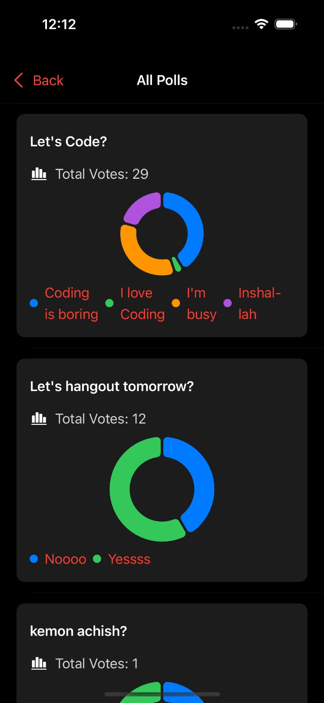
A complete list of available polls, with detailed vote counts and result charts for each option.

## Create Poll Screen
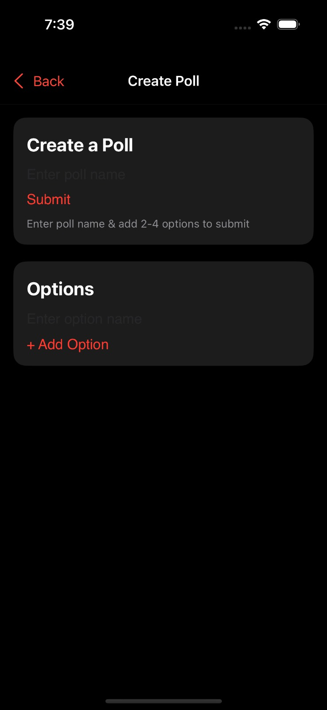
A streamlined interface for users to create their own polls. Users can input a poll name, add 2-4 options, and submit the poll for participation.

## Poll Details Screen
 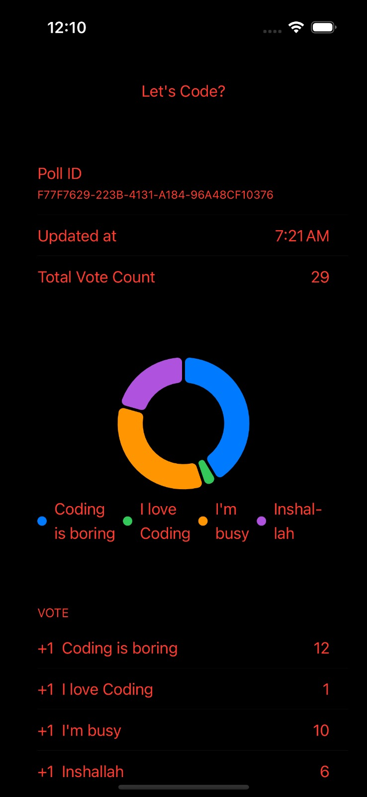 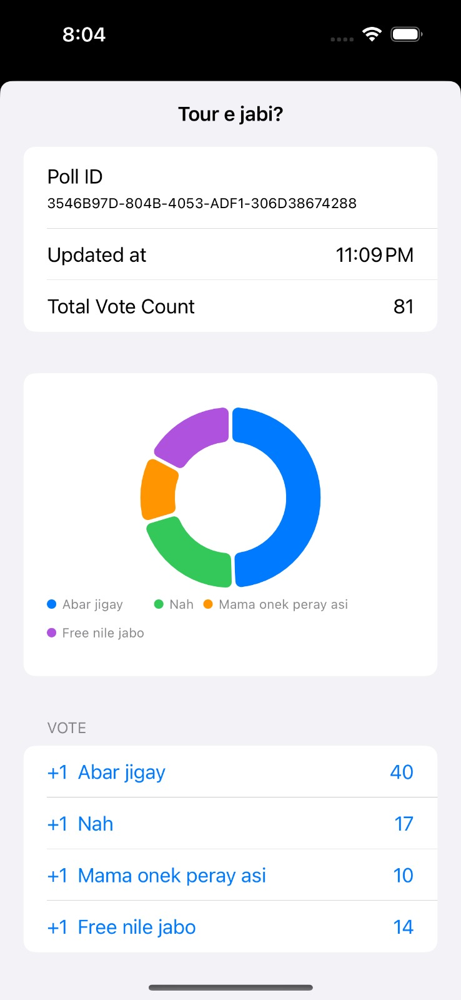
 Displays detailed information about a specific poll, including the poll ID, update time, total vote count, and a detailed donut chart with vote breakdown by option.

## Text Settings Screen
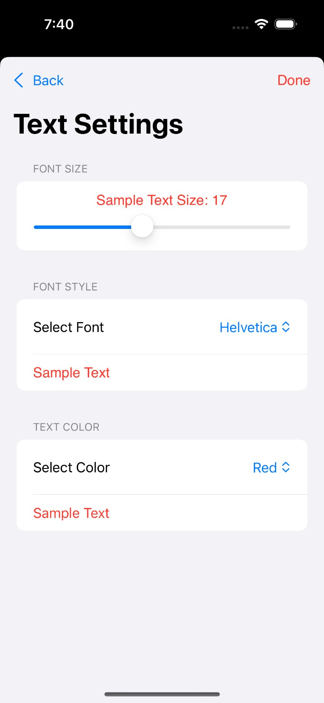
Allows users to customize text size, font style, and color in the app. Includes a real-time preview to show how the selected settings will appear.

## Logout Confirmation Dialog
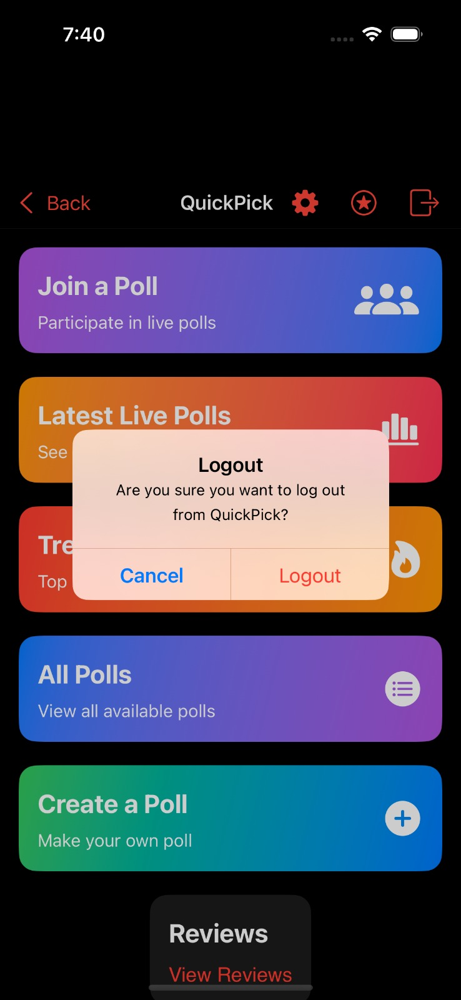
A modal dialog appears asking for confirmation when a user attempts to log out, offering options to cancel or proceed.

---

## How It Works

### **Sign-Up**
1. User enters their email, username, password, and confirms the password.
2. The app interacts with Firebase Authentication API to create a new user.
3. Upon successful registration, the user is directed to the home screen.

### **Log-In**
1. User enters their email and password.
2. Firebase Authentication verifies the credentials.
3. Upon successful login, the user is taken to the home screen.

### **Home Screen**
1. The home screen displays options for users to join polls, view the latest polls, check trending polls, view all polls, or create a poll.
2. Navigation to any section is seamless through interactive buttons.

### **Join Polls**
1. User taps "Join a Poll."
2. The app retrieves available polls from Firebase Firestore.
3. User can vote on a poll and see real-time updates of the results.

### **Create a Poll**
1. User navigates to "Create a Poll."
2. The app allows users to input the poll name and add 2–4 options.
3. Once submitted, the poll is saved in Firebase Firestore and made available to other users.

### **View Poll Results**
1. Users can view detailed results for each poll, including vote counts and percentage breakdowns.
2. Results are displayed using intuitive charts for clear visualization.

### **Log-Out**
1. User taps the "Logout" button.
2. The app calls the Firebase sign-out method to log the user out.
3. The user is redirected to the login screen.

---

## Prerequisites and Dependencies

1. **Firebase Project**: Set up a Firebase project and enable Authentication and Firestore services [Firebase Console](https://console.firebase.google.com/).
2. **iOS Setup**: Add the GoogleService-Info.plist file to your Xcode project for Firebase integration.
3. **Firebase SDK Setup**: Install the Firebase SDK by following the instructions on the [Firebase iOS SDK GitHub repository](https://github.com/firebase/firebase-ios-sdk)
4. **Xcode Requirements**: Use Xcode 12 or later with a deployment target of iOS 14.0 or newer.
5. **SwiftUI**: The app is built with SwiftUI, so basic knowledge of it is recommended.
6. **Apple Developer Account**: Required for deploying the app on a device or publishing to the App Store.
7. **Internet Connection**: Necessary for Firebase's real-time updates and syncing data.

---

## Dependencies

- **Firebase SDK**: Used for authentication, real-time database, and Firestore integration.
- **SwiftUI**: Used for building a modern, responsive user interface.
- **Xcode 14 or higher**: Recommended for compatibility and to ensure access to the latest features.
- **CocoaPods**: For managing dependencies like Firebase SDK.
- **iOS 14.0 or later**: Required for running the app on supported devices.

---

## MIT License

Copyright (c) 2025 Shaeer Musarrat Swapnil
